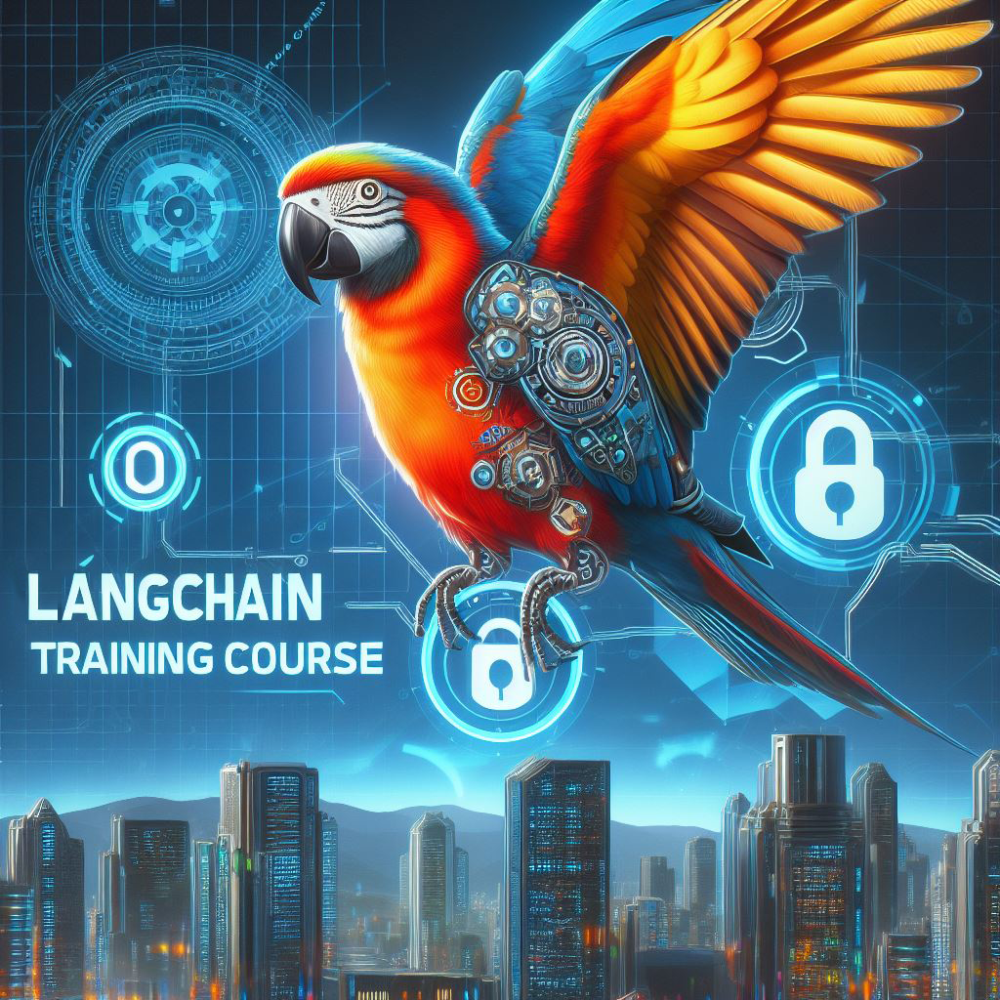

# **Langchain Training Material**

## Content
<!-- 1. Introduction
2. Model I/O
3. Retreival
4. Chains
5. Memory
6. Agents -->

    

        <ol>1. Introduction</ol>
        <ol>2. Model I/O</ol>
        <ol>3. Retreival</ol>
        <ol>4. Chains</ol>
        <ol>5. Memory</ol>
        <ol>6. Agents</ol>
    

    

        
    

## Topics covered

1. [Langchain Introduction](https://saisrinivas-samoju.github.io/langchain_training/introduction/) [1 Hour]
    * Modules Overview
    * OpenAI API Connection
    * Loading LLMs
        * OpenAI
        * Open source models
    * Basic Prompting
    * Referring Documentation

2. [Model I/O](https://saisrinivas-samoju.github.io/langchain_training/model_io/) [4.5 Hours]
    * Prompt for text-completion and chat-completion models
    * Response Caching
    * Few Shot Prompting
    * Prompt Templating
    * Serialization - Saving & Loading Prompts
    * Output Parsing
    * Sample Project
    * Deploying Project with a Frontend (Local & Cloud)

3. [Retreival](https://saisrinivas-samoju.github.io/langchain_training/retrieval/) [4.5 Hours]
    * Introduction
    * Data Loaders (with Assignment)
    * Text Splitters
    * Embedding Functions
    * Vector Stores
    * Retrievers

## Upcoming topics

<!-- * Deploying Gradio Applications in Hugging Face Spaces -->
* [Retreival](https://python.langchain.com/docs/modules/data_connection/)
    

## Latest available Tutorial code

* [Model Connection](https://github.com/saisrinivas-samoju/langchain_training/blob/main/tutorials/model_connection.ipynb)
* [Model I/O](https://github.com/saisrinivas-samoju/langchain_training/blob/main/tutorials/model_io.ipynb)
* [Retreival](https://github.com/saisrinivas-samoju/langchain_training/blob/main/tutorials/retrieval.ipynb)

## Latest available Reference code

* [Model Connection](https://github.com/saisrinivas-samoju/langchain_training/blob/main/notebooks/model_connection.ipynb)
* [Model I/O](https://github.com/saisrinivas-samoju/langchain_training/blob/main/notebooks/model_io.ipynb)

## Smart Chef Project code
* [Smart Chef Code](https://saisrinivas-samoju.github.io/langchain_training/model_io/#exercise-create-a-smart-chef-bot-that-can-give-you-recipes-based-on-the-available-food-items-you-have-in-your-kitchen)

## Tasks/Exercies/Projects assigned
* Create a cross-questioning model with and without a system prompt
* Write a blog on few shot prompting
* Project ideas (Pick any one of them)
    * Real time text translation
    * Text Summarization tool
    * Q&A System
    * Travel Planner
    * Tweet Responder
* Deploy your own project or the sample project