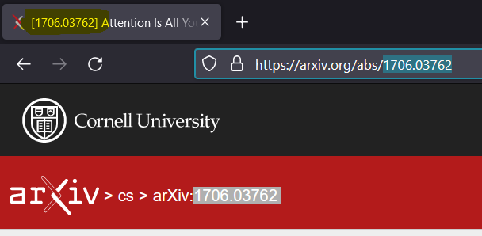

# Retrieval

Large language models are trained on massive datasets, but they don't know everything. That's where Retrieval Augmented Generation (RAG) comes in, and LangChain has you covered with all the basics to Advanced bulding blocks:


1. **Document loaders:**
   Learn how to put your own information into the training mix.

2. **Text Splitters:**
   Find out how to tweak your data to make the model understand better.

3. **Text Embedding Models:**
   Discover ways to seamlessly include your information within the model.

4. **Vector Stores:**
   Explore ways to save these tweaks for quick and efficient retrieval.

5. **Retrievers:**
   Learn how to ask the model for the information you stored.

LangChain breaks down each step, making it easy for you to make the most of RAG with your language models.

---

## Document Loaders
### CSV Loader

```python
from langchain.document_loaders import CSVLoader
loader = CSVLoader(file_path='../datasets/sns_datasets/titanic.csv') # Lazy Loader
loader
```
      > <langchain_community.document_loaders.csv_loader.CSVLoader at 0x147b62e5760>
   
```python
data = loader.load()

data
```
      > [Document(page_content='survived: 0\npclass: 3\nsex: male\nage: 22.0\nsibsp: 1\nparch: 0\nfare: 7.25\nembarked: S\nclass: Third\nwho: man\nadult_male: True\ndeck: \nembark_town: Southampton\nalive: no\nalone: False', metadata={'source': '../datasets/sns_datasets/titanic.csv', 'row': 0}), Document(page_content='survived: 1\npclass: 1\nsex: female\nage: 38.0\nsibsp: 1\nparch: 0\nfare: 71.2833\nembarked: C\nclass: First\nwho: woman\nadult_male: False\ndeck: C\nembark_town: Cherbourg\nalive: yes\nalone: False', metadata={'source': '../datasets/sns_datasets/titanic.csv', 'row': 1}), ...]
Python list of document objects; Each row in a separate document object

```python
data[0] # Single Row
```
      > Document(page_content='survived: 0\npclass: 3\nsex: male\nage: 22.0\nsibsp: 1\nparch: 0\nfare: 7.25\nembarked: S\nclass: Third\nwho: man\nadult_male: True\ndeck: \nembark_town: Southampton\nalive: no\nalone: False', metadata={'source': '../datasets/sns_datasets/titanic.csv', 'row': 0})

```python
type(data[0])
```
      > langchain_core.documents.base.Document

To get the document content
```python
print(data[0].page_content)
```
      >  survived: 0
         pclass: 3
         sex: male
         age: 22.0
         sibsp: 1
         parch: 0
         fare: 7.25
         embarked: S
         class: Third
         who: man
         adult_male: True
         deck: 
         embark_town: Southampton
         alive: no
         alone: False

To get the metadata

```python
print(data[0].metadata)
```
      > {'source': '../datasets/sns_datasets/titanic.csv', 'row': 0}

Specify a column name to identify the dataset

```python
data = CSVLoader(file_path='../datasets/sns_datasets/titanic.csv', source_column= 'sex').load()
```

### HTML Loader

Similar syntax
```python
from langchain.document_loaders import UnstructuredHTMLLoader
loader = UnstructuredHTMLLoader('../datasets/harry_potter_html/001.htm')
data = loader.load()
data
```
      > [Document(page_content='A Day of Very Low Probability\n\nBeneath the moonlight glints a tiny fragment of silver, a fraction of a line…\n\n ...

Loading HTML documents with BeautifulSoup

```python
from langchain.document_loaders import BSHTMLLoader
loader = BSHTMLLoader('../datasets/harry_potter_html/001.htm')
data = loader.load()
data
```
      > A Day of Very Low Probability

      Beneath the moonlight glints a tiny fragment of silver, a fraction of a line…
      (black robes, falling)
      …blood spills out in litres, and someone screams a word. ...

This response is close to the content in the HTML file.

### Markdown Loader

```python
from langchain.document_loaders import UnstructuredMarkdownLoader

md_filepath = "../datasets/harry_potter_md/001.md"

loader = UnstructuredMarkdownLoader(file_path=md_filepath)

data = loader.load()

data
```
      > [Document(page_content='A Day of Very Low Probability\n\nBeneath the moonlight glints a tiny fragment of silver ...

### PDF Loader
```python
from langchain.document_loaders import PyPDFLoader

loader = PyPDFLoader('../datasets/harry_potter_pdf/hpmor-trade-classic.pdf')

data = loader.load()

data
```
      [Document(page_content='Harry Potter and the Methods of Rationality', metadata={'source': '../datasets/harry_potter_pdf/hpmor-trade-classic.pdf', 'page': 0}),
      Document(page_content='', metadata={'source': '../datasets/harry_potter_pdf/hpmor-trade-classic.pdf', 'page': 1}), ...

### Wikipedia

```python
from langchain.document_loaders import WikipediaLoader
loader = WikipediaLoader(query='India', load_max_docs=1)
data = loader.load()

data
```
      > [Document(page_content="India, officially the Republic of India (ISO: Bhārat Gaṇarājya), ...

Since we are only loading one document, the number of document objects in the response list is also 1
```python
len(data)
```
      > 1

To get the metadata
```python
# select the document object
data[0].metadata
```
      > {'title': 'India',
      'summary': "India, officially the Republic of India (ISO: Bhārat Gaṇarājya), ...",
      'source': 'https://en.wikipedia.org/wiki/India'}

Call the keys of the dictionary to get the specific information from the metadata.

Information from the metadata can be used to filter you data in the later stages.

### ArXiv Loader

Loading the content from the famous scientific article publisher

To get the article IDs of any ArXiv papers, check the URL of the page or header of the page.



```python
from langchain_community.document_loaders import ArxivLoader

loader = ArxivLoader(query='2201.03916', load_max_docs=1) # AutoRL paper (article ID -> 2201.03916)

data = loader.load()

data
```
      > [Document(page_content='Journal of Artificial Intelligence Research 74 (2022) ...

```python
len(data) # since load_max_docs=1
```
      > 1

```python
print(data[0].page_content)
```  
      > Journal of Artificial Intelligence Research 74 (2022) 517-568
      Submitted 01/2022; published 06/2022
      Automated Reinforcement Learning (AutoRL):

Getting the metadata similar to the previous steps

```python
data[0].metadata
```
      > {'Published': '2022-06-02',
      'Title': 'Automated Reinforcement Learning (AutoRL): A Survey and Open Problems',
      'Authors': 'Jack Parker-Holder, Raghu Rajan, Xingyou Song, André Biedenkapp, Yingjie Miao, Theresa Eimer, Baohe Zhang, Vu Nguyen, Roberto Calandra, Aleksandra Faust, Frank Hutter, Marius Lindauer',
      'Summary': 'The combination of Reinforcement Learning (RL) ..."}

Let's connect the retrieved information to the LLM

```python
import os
from langchain_openai import ChatOpenAI
from langchain.globals import set_llm_cache
from langchain.cache import InMemoryCache

with open("../openai_api_key.txt", 'r') as f:
    os.environ['OPENAI_API_KEY'] = f.read()

chat = ChatOpenAI()
set_llm_cache(InMemoryCache())
```

```python
# Setting up the prompt templates

from langchain.prompts.chat import ChatPromptTemplate, SystemMessagePromptTemplate, HumanMessagePromptTemplate, AIMessagePromptTemplate

system_template = "You are Peer Reviewer"
human_template = "Read the paper with the title: '{title}'\n\nAnd Content: {content} and critically list down all the issues in the paper"

system_message_prompt = SystemMessagePromptTemplate.from_template(system_template)
human_message_prompt = HumanMessagePromptTemplate.from_template(human_template)

chat_prompt = ChatPromptTemplate.from_messages(messages=[system_message_prompt, human_message_prompt])
prompt = chat_prompt.format_prompt(title=data[0].metadata['Title'], content=data[0].page_content)
messages = prompt.to_messages()

response = chat(messages=messages)

print(response.content)
```
      > Overall, the paper "Attention Is All You Need" presents a novel model architecture, the Transformer, which is based solely on attention mechanisms and dispenses with recurrence and convolutions. The paper provides a detailed description of the model architecture, background information, model variations, training process, and results in machine translation and English constituency parsing tasks. The paper also includes attention visualizations to illustrate the behavior of the attention heads.

      Here are some key points to consider for a critical review of the paper: ...

```python
def peer_review(article_id):
    chat = ChatOpenAI(max_tokens=500)
    loader = ArxivLoader(query=article_id, load_max_docs=1)
    data = loader.load()
    page_content = data[0].page_content
    title = data[0].metadata['Title']
    summary = data[0].metadata['Summary']

    system_template = "You are Peer Reviewer"
    human_template = "Read the paper with the title: '{title}'\n\nAnd Content: {content} and critically list down all the issues in the paper"

    system_message_prompt = SystemMessagePromptTemplate.from_template(system_template)
    human_message_prompt = HumanMessagePromptTemplate.from_template(human_template)

    chat_prompt = ChatPromptTemplate.from_messages(messages=[system_message_prompt, human_message_prompt])

    try:
        prompt = chat_prompt.format_prompt(title=title, content=page_content) # Suggest not to go with this
        messages = prompt.to_messages()
        response = chat(messages=messages)
    except:
        prompt = chat_prompt.format_prompt(title=title, content=summary)
        messages = prompt.to_messages()
        response = chat(messages=messages)

    return response.content
```


```python
print(peer_review(article_id='2201.03514')) # Black-Box Tuning for Language-Model-as-a-Service
```

      > After reviewing the paper titled 'Black-Box Tuning for Language-Model-as-a-Service', I have identified several issues in the paper that need to be addressed before it can be considered for publication:

      1. Lack of Clarity in Problem Statement: The paper does not clearly define the problem statement or research question it aims to address. It is unclear why optimizing task prompts through black-box tuning for Language-Model-as-a-Service (LMaaS) is important or how it contributes to the existing body of knowledge.

## Text Splitter
### Split by character

Reading the data

```python
filepath = "../datasets/Harry Potter 1 - Sorcerer's Stone.txt"

with open(filepath, 'r') as f:
    hp_book = f.read()
    
print("Number of characters letters in the document:", len(hp_book))
print("Number of words in the document:", len(hp_book.split()))
print("Number of lines in the document:", len(hp_book.split("\n")))
```
      Number of characters letters in the document: 439742
      Number of words in the document: 78451
      Number of lines in the document: 10703

To understand the how the number of characters if we use any separator manually

```python
from collections import Counter

line_len_list = []

for line in hp_book.split("\n"):
    curr_line_len = len(line)
    line_len_list.append(curr_line_len)
    
Counter(line_len_list) # It show how many those chunks with the same character length is present
```

      > Counter({37: 57,
            0: 3057,
            11: 38,
      ...
            4: 15,
            3: 9,
            2: 1})

### Character Text Splitter

Splitting the text at a specific character only if the chunk exceeds the given chunk size

```python
from langchain.text_splitter import CharacterTextSplitter

def len_func(text): # In this case, you can just use >len<
    return len(text)

text_splitter = CharacterTextSplitter(
    separator="\n\n",
    chunk_size=1200,
    chunk_overlap=100,
    length_function=len_func,
    is_separator_regex=False
)

para_list = text_splitter.create_documents(texts=[hp_book])

para_list
```

      > [Document(page_content="Harry Potter and the Sorcerer's Stone\n\n\nCHAPTER ONE\n\nTHE BOY WHO LIVED
      ...
      I\'m going to have a lot of fun with Dudley this summer...."\n\nTHE END')]

To add metadata for the document objects

```python
first_chunk = para_list[0]

# Just assign/reassign
first_chunk.metadata = {"source": filepath}

first_chunk.metadata
```
      > {'source': "../datasets/Harry Potter 1 - Sorcerer's Stone.txt"}

What if the text exceeds the chunk length and there is not separator to chunk the text?

```python
# Adding the extra line
extra_line = " ".join(['word']*500)

para_list = text_splitter.create_documents(texts = [extra_line + hp_book])

# checking the length of the first line as the extra line is added there
first_chunk_text = para_list[0].page_content

len(first_chunk_text)
```
      Created a chunk of size 2536, which is longer than the specified 1200
      > 2536

Can we add multiple separators to make it working better?

That's where Recursive Character Text Splitter comes in.

### Recursive Character Splitter

It tries to split on them in order until the chunks are small enough.
The default list is <code>["\n\n", "\n", " ", ""]</code>. This has the effect of trying to keep all paragraphs (and then sentences, and then words) together as long as possible, as those would generically seem to be the strongest semantically related pieces of text.

```python
from langchain.text_splitter import RecursiveCharacterTextSplitter

text_splitter = RecursiveCharacterTextSplitter(
    separators=["\n\n", "\n", ' '],
    chunk_size = 200,
    chunk_overlap = 100,
    length_function = len_func,
    is_separator_regex=False
)

# Here, the split first happens at "\n\n", if the chunk size exceeds, it will move to the next separator, if it still exceeds, it will move to the next separator which is a " ".

chunk_list = text_splitter.create_documents(texts = [hp_book])

chunk_list
```
      > [Document(page_content='CHAPTER ONE\n\nTHE BOY WHO LIVED'),
      ...]

Let's see how this chunking process work in the previous scenario

```python
chunk_list = text_splitter.create_documents(texts = [extra_line + hp_book]) # Adding the extra line

chunk_list
```

      > [Document(page_content='word word word word word word ...

      ...]

The text got chunked at spaces to maintain the chunk size in the first line.

### Split by tokens

tiktoken is a python library developed by openAI to count the number of tokens in a string without making an API call.
```console
pip install tiktoken
```

Splitting based on the token limit

```python
from langchain.text_splitter import CharacterTextSplitter

text_splitter = CharacterTextSplitter.from_tiktoken_encoder(
    separator="\n\n", 
    chunk_size=1200, 
    chunk_overlap=100, 
    is_separator_regex=False,
    model_name='text-embedding-3-small',
    encoding_name='text-embedding-3-small', # same as model name
)

doc_list = text_splitter.create_documents([hp_book])

doc_list
```
      > [Document(page_content="Harry Potter and the Sorcerer's Stone\n\n\nCHAPTER ONE\n\nTHE BOY WHO LIVED
      ...
      I\'m going to have a lot of fun with Dudley this summer...."\n\nTHE END')]

The model name here refers to the model used for calculating the tokens.

To split the text and return the text chunks

```python
line_list = text_splitter.split_text(hp_book)

line_list
```
      > ['Harry Potter and the Sorcerer\'s Stone\n\n\nCHAPTER ONE\...
      ...Dudley this summer...."\n\nTHE END']

If you want to convert the split text into list of document objects
```python
from langchain.docstore.document import Document

doc_list = []

for line in line_list:
    curr_doc = Document(page_content=line, metadata={"source": filepath})
    doc_list.append(curr_doc)
    
doc_list
```
      > [Document(page_content="Harry Potter and the Sorcerer's Stone\n\n\nCHAPTER ONE\n\nTHE BOY WHO LIVED
      ...
      I\'m going to have a lot of fun with Dudley this summer...."\n\nTHE END')]

### Code Splitting

Let's learn a generic way of splitting code that's written in any language. For this let's convert the previous peer_review function code into text.

```python
python_code = """def peer_review(article_id):
    chat = ChatOpenAI()
    loader = ArxivLoader(query=article_id, load_max_docs=2)
    data = loader.load()
    first_record = data[0]
    page_content = first_record.page_content
    title = first_record.metadata['Title']
    summary = first_record.metadata['Summary']
    
    summary_list = []
    for record in data:
        summary_list.append(record.metadata['Summary'])
    full_summary = "\n\n".join(summary_list)
    
    system_template = "You are a Peer Reviewer"
    human_template = "Read the paper with the title: '{title}'\n\nAnd Content: {content} and critically list down all the issues in the paper"

    systemp_message_prompt = SystemMessagePromptTemplate.from_template(system_template)
    human_message_prompt = HumanMessagePromptTemplate.from_template(human_template)

    chat_prompt = ChatPromptTemplate.from_messages([systemp_message_prompt, human_message_prompt])
    prompt = chat_prompt.format_prompt(title=title, content=page_content)

    response = chat(messages = prompt.to_messages())

    return response.content"""
```

```python
from langchain.text_splitter import RecursiveCharacterTextSplitter, Language

text_splitter = RecursiveCharacterTextSplitter.from_language(
    language=Language.PYTHON,
    chunk_size=50,
    chunk_overlap=10
)

text_splitter.create_documents(texts = [python_code])
```

      > [Document(page_content='def peer_review(article_id):'),
      Document(page_content='chat = ChatOpenAI()'),
      ...
      Document(page_content='= prompt.to_messages())'),
      Document(page_content='return response.content')]

Similar to python code, you can also split any the code in programming language. For example: To split javascript code use <code>Language.JS</code>

### Semantic Chunking

### Embeddings

Embeddngs are stored along with their corresponding text in the vector database. When queried, the query text is converted to embeddngs using the same embedding function and find the similar embeddings in the vector database and returns corresponding matching text.

#### OpenAI Embeddings
```py
import os
from langchain.embeddings import OpenAIEmbeddings

with open('../openai_api_key.txt', 'r') as f:
    api_key = f.read()
    
os.environ['OPENAI_API_KEY'] = api_key
```

Either set the environment variable or pass it as a keyword parameter as shown below, just like any llm

```py
embeddings = OpenAIEmbeddings(openai_api_key=api_key)
```
Creating a sample text
```py
text = "The scar had not pained Harry for nineteen years. All was well."
```
Embedding the text
```py
embedded_text = embeddings.embed_query(text)

embedded_text
```
      > [-0.00598582291957263,
      0.02148159007746089,
      ...]


```py
len(embedded_text)
```
      > 1536

```py
# If we have n lines in langchain document format
from langchain.docstore.document import Document

doc_lines = [
    Document(page_content=text, metadata={"source": "Harry Potter"}),
    Document(page_content="It is our choices, Harry, that show what we truly are, far more than our abilities",
             metadata={"source": "Harry Potter"})
]

doc_lines # consider this to be the response from text splitters
```
      > [Document(page_content='The scar had not pained Harry for nineteen years. All was well.', metadata={'source': 'Harry Potter'}),
      Document(page_content='It is our choices, Harry, that show what we truly are, far more than our abilities', metadata={'source': 'Harry Potter'})]

```py
# We will extract the page content

line_list = [doc.page_content for doc in doc_lines]
```

```py
embedded_docs = [embeddings.embed_query(line) for line in line_list]

np.array(embedded_docs).shape
```
      > (2, 1536)

* OpenAI embeddings are not the best ranked MTEB (Massive text embedding benchmark) models (https://huggingface.co/spaces/mteb/leaderboard)
* On top of it, they are expensive.
* *So, let's explore some open source best performing text embedding models

#### BGE Embeddings

* BGE models on the HuggingFace are the best open-source embedding models that are also integrated with langchain as of now.
* BGE Model is created by the Beijing Academy of Artificial Intelligence (BAAI).
* BAAI is a private non-profit organization engaged in AI research and development.

```console
pip install sentence_transformers
```

```py
import numpy as np
from langchain.embeddings import HuggingFaceBgeEmbeddings

model_name = "BAAI/bge-base-en-v1.5"
model_kwargs = {"device": "cpu"}
encode_kwargs = {"normalize_embeddings": True}

hf = HuggingFaceBgeEmbeddings(
    model_name=model_name,
    model_kwargs=model_kwargs,
    encode_kwargs=encode_kwargs
)
```

#### Fake Embeddings
For testing purposes, if you have some hardware restrictions, you can use Fake Embeddings from Langchain

```py
from langchain_community.embeddings import FakeEmbeddings
fake_embeddings = FakeEmbeddings(size=300) # Define the embedding size

fake_embedded_record = fake_embeddings.embed_query("This is some random text")
fake_embedded_records = fake_embeddings.embed_documents(["This is some random text"])
```
Single record
```py
np.array(fake_embedded_record).shape
```
      (300,)

For multiple records
```py
np.array(fake_embedded_records).shape
```
      (1, 300)

### Vector Store
```console
pip install chromadb qdrant-client faiss-cpu
```
Imports

```py
from langchain_community.document_loaders import WikipediaLoader
from langchain.text_splitter import RecursiveCharacterTextSplitter
from langchain.embeddings import HuggingFaceBgeEmbeddings
from langchain_community.vectorstores import FAISS
```

Document Loading

```py
loader = WikipediaLoader(query='Elon Musk', load_max_docs=5)
documents = loader.load()
documents
```
      > [Document(page_content='Elon Reeve Musk (; EE-lon; born June 28, 1971) is a businessman...)
      Document(page_content='Business magnate Elon Musk initiated an acquisition of American...
      Document(page_content='Elon Musk completed his acquisition of Twitter...
      Document(page_content='The Musk family is a wealthy family of South African origin...
      Document(page_content='Elon Musk is the CEO or owner of multiple companies including Tesla...]


Text splitting
```py
text_splitter = RecursiveCharacterTextSplitter(chunk_size=400, chunk_overlap=100)
docs = text_splitter.split_documents(documents=documents)
print(len(docs))
docs
```
      > [Document(page_content='Elon Reeve Musk (; EE-lon; born June 28, 1971) is a businessman and investor...
      Document(page_content='of Neuralink and OpenAI; and president of the Musk Foundation....
      Document(page_content="Tesla and SpaceX.A member of the wealthy South African Musk family,...
      ...]

Defining the embedding function
```py
model_name = "BAAI/bge-large-en-v1.5"
model_kwargs = {'device': 'cpu'}
encode_kwargs = {"normalize_embeddings": True}

embedding_function = HuggingFaceBgeEmbeddings(
    model_name=model_name,
    model_kwargs=model_kwargs,
    encode_kwargs=encode_kwargs
)
```
Query:
```py
query = "Who is elon musk's father?"
```
#### FAISS
Creating a vector database (FAISS - in memory database)
```py
db = FAISS.from_documents(
    docs,
    embedding_function
)
```

Querying the vector database
```py
matched_docs = db.similarity_search(query=query, k=5)

matched_docs
```
      > [Document(page_content="Elon Musk's paternal great-grandmother was a Dutchwoman descended from the Dutch Free Burghers, while one of his maternal great-grandparents came from Switzerland. Elon Musk's father, Errol Musk, is a South African former electrical ...', 'source': 'https://en.wikipedia.org/wiki/Musk_family'}),
      Document(page_content="Elon Reeve Musk was born on June 28, 1971, in Pretoria, South Africa's administrative capital. ...,
      Document(page_content='Elon Reeve Musk (; EE-lon; born June 28, 1971) is a businessman and investor....,
      Document(page_content='father, Errol Musk, is a South African former electrical and mechanical engineer consultant and property developer, ...,
      Document(page_content="Elon Musk (born 1971), entrepreneur and business magnate. Variously CEO, CTO, and/or Chairman of SpaceX, Tesla, Twitter (now X), and Neuralink...]

Check if the answer is present in results

```py
['errol musk' in doc.page_content.lower() for doc in matched_docs] # Errol Musk is the answer
```
      > [True, True, False, True, False]

FAISS is an in-memory vector store.

And most of the times, we don't use these in-memory vector stores.

#### ChromaDB
Let's start with chromaDB and understand how to...
* Save the vector store
* Load the vector store
* Add new records to vector store.

```py
import chromadb
from langchain.vectorstores import Chroma
```

Creating a Chroma Vector Store

```py
db = Chroma.from_documents(docs, embedding_function, persist_directory='../output/elon_musk_db')
```

Loading the db

```py
laoded_db = Chroma(persist_directory="../output/elon_musk_db", embedding_function=embedding_function)
```

Querying the DBs

```py
print(query)

matched_docs = db.similarity_search(
    query = query,
    k = 5
)

matched_docs
```
      Who is elon musk's father?
      > [Document(page_content="Elon Musk's paternal great-grandmother was a Dutchwoman descended from the Dutch Free Burghers, while one of his maternal great-grandparents came from Switzerland. Elon Musk's father, Errol Musk, is a South African former electrical ...', 'source': 'https://en.wikipedia.org/wiki/Musk_family'}),
      Document(page_content="Elon Reeve Musk was born on June 28, 1971, in Pretoria, South Africa's administrative capital. ...,
      Document(page_content='Elon Reeve Musk (; EE-lon; born June 28, 1971) is a businessman and investor....,
      Document(page_content='father, Errol Musk, is a South African former electrical and mechanical engineer consultant and property developer, ...,
      Document(page_content="Elon Musk (born 1971), entrepreneur and business magnate. Variously CEO, CTO, and/or Chairman of SpaceX, Tesla, Twitter (now X), and Neuralink...]

As the embedding function and the text splitter are same in both the previous FAISS and current ChromaDB, the results are also the same.

```py
['errol musk' in doc.page_content.lower() for doc in matched_docs]
```
      > [True, True, False, True, False]

Adding a new record to the existing vector store
```py
family_data_loader = WikipediaLoader(query='Musk Family', load_max_docs=1)
family_documents = family_data_loader.load()
family_documents
```
      > [Document(page_content='The Musk family is a wealthy family of South African origin that is largely active in the United States and Canada. ... metadata={'title': 'Musk family', 'summary': 'The Musk family is a wealthy family ...', 'source': 'https://en.wikipedia.org/wiki/Musk_family'})]

Using the exising text splitter

```py
family_docs = text_splitter.split_documents(documents=family_documents)
print(len(family_docs))
family_docs
```
11
      [Document(page_content='The Musk family is a wealthy family of South African...', metadata={'title': 'Musk family', 'summary': 'The Musk family is a wealthy family...', 'source': 'https://en.wikipedia.org/wiki/Musk_family'}),
      Document(page_content='in the world, with an estimated net worth of US$232 billion ...', 'summary': 'The Musk family is a wealthy family...', 'source': 'https://en.wikipedia.org/wiki/Musk_family'}),
      Document(page_content='== History ==', metadata={'title': 'Musk family', 'summary': 'The Musk...', 'source': 'https://en.wikipedia.org/wiki/Musk_family'}),
      Document(page_content="Elon Musk's paternal great-grandmother...', metadata={'title': 'Musk family', 'summary': 'The Musk family ...', 'source': 'https://en.wikipedia.org/wiki/Musk_family'}),
      ...]

Using the same loaded embedded function

```py
db = Chroma.from_documents(
    family_docs, # The new docs that we want to add
    embedding_function, # Should be the same embedding function
    persist_directory="../output/elon_musk_db" # Existing vectorstore where we want to add the new records
)
```

Getting the matching documents with the query
```py
matched_docs = db.similarity_search(query=query, k=5)

['errol musk' in doc.page_content.lower() for doc in matched_docs]
```
      > [True, True, True, False, True]

More number of records are getting matched.

## Retrievers
Making a retriever from vector store

We can also define how the vectorstores should search and how many items to return

### Vector store-backed retriever
```py
retriever = db.as_retriever()

retriever
```
      > VectorStoreRetriever(tags=['Chroma', 'HuggingFaceBgeEmbeddings'], vectorstore=<langchain_community.vectorstores.chroma.Chroma object at 0x000001B97D293EE0>

Querying a retriever
```py
matched_docs = retriever.get_relevant_documents(query=query)

matched_docs
```

```
> [Document(page_content="Elon Musk's paternal great-grandmother was a Dutchwoman descended from the Dutch Free Burghers, while one of his maternal great-grandparents came from Switzerland. Elon Musk's father, Errol Musk, is a South African former electrical ...', 'source': 'https://en.wikipedia.org/wiki/Musk_family'})"),
Document(page_content="Elon Reeve Musk was born on June 28, 1971, in Pretoria, South Africa's administrative capital. ..."),
Document(page_content='Elon Reeve Musk (; EE-lon; born June 28, 1971) is a businessman and investor....'),
Document(page_content='father, Errol Musk, is a South African former electrical and mechanical engineer consultant and property developer, ...'),
Document(page_content="Elon Musk (born 1971), entrepreneur and business magnate. Variously CEO, CTO, and/or Chairman of SpaceX, Tesla, Twitter (now X), and Neuralink...]")
```

```py
len(matched_docs)
```
      > 4

MMR - Maximum marginal relevance (relevancy and diversity)

```py
retriever = db.as_retriever(search_type='mmr', search_kwargs={"k": 1})

matched_docs = retriever.get_relevant_documents(query=query)

matched_docs
```

      > [Document(page_content="Elon Musk's paternal great-grandmother was a Dutchwoman descended from the Dutch Free Burghers, ...", metadata={'source': 'https://en.wikipedia.org/wiki/Musk_family', 'summary': 'The Musk family ...', 'title': 'Musk family'})]

Similarity Score threshold

```py
retriever = db.as_retriever(search_type="similarity_score_threshold", search_kwargs={"score_threshold": 0.5})

matched_docs = retriever.get_relevant_documents(query=query)

matched_docs
```
### Advanced Retrievers

Let's setup the stage for the working on the following advanced retrievers

```py
# Imports
import chromadb
from dotenv import load_dotenv
from langchain.chat_models import ChatOpenAI
from langchain_community.document_loaders import WikipediaLoader
from langchain.text_splitter import RecursiveCharacterTextSplitter
from langchain.embeddings import HuggingFaceBgeEmbeddings
from langchain.vectorstores import Chroma

chunk_size = 400
chunk_overlap = 100

# Loading the environment variables
load_dotenv()

# Loading the chat model
chat = ChatOpenAI()

# Loading data
loader = WikipediaLoader(query='Steve Jobs', load_max_docs=5)
documents = loader.load()

# Text splitting
text_splitter = RecursiveCharacterTextSplitter(chunk_size=chunk_size, chunk_overlap=chunk_overlap)
docs = text_splitter.split_documents(documents=documents)

# Embedding function
embedding_function = HuggingFaceBgeEmbeddings(
    model_name="BAAI/bge-large-en-v1.5",
    model_kwargs={'device': 'cpu'},
    encode_kwargs={"normalize_embeddings": True}
)

# Vector store
db = Chroma.from_documents(docs, embedding_function, persist_directory="../output/steve_jobs_db")

# Retriever
retriever = db.as_retriever()

# Query
query = "When was Steve Jobs fired from Apple?"
```

#### Multi-Query Retriever
For paraphrasing queries in different ways to reduce the emphasis on the way the query is written and increase on the emphasis on the key points of the query.

LLMs are used to do this.

```py
from langchain.retrievers.multi_query import MultiQueryRetriever

retriever_from_llm = MultiQueryRetriever.from_llm(
    retriever=retriever,
    llm=chat
)
```
To understand how to multiple queries are genered in the background; Let's define a logger.

```py
import logging
logging.basicConfig()
logging.getLogger('langchain.retrievers.multi_query').setLevel(logging.INFO)
```
Get the responses from the vector database

Since, we performed logging we can see the generated queries

```py
retrieved_docs = retriever_from_llm.get_relevant_documents(query=query)

retrieved_docs
```
      INFO:langchain.retrievers.multi_query:Generated queries: ["1. What was the date of Steve Jobs' departure from Apple due to termination?", '2. At what point in time was Steve Jobs ousted from his position at Apple?', "3. When did Steve Jobs face dismissal from Apple's leadership role?"]

```
> [Document(page_content="In 1985, Jobs departed Apple after a long power struggle with the company's board ...", metadata={'source': 'https://en.wikipedia.org/wiki/Steve_Jobs', 'summary': 'Steven Paul Jobs (February 24, 1955 – October 5, 2011) was an American businessman, ...', 'title': 'Steve Jobs'}),
...
 Document(page_content="== Plot ==\nIn 1984, the Apple Macintosh 128K's voice demo fails ...", metadata={'source': 'https://en.wikipedia.org/wiki/Steve_Jobs_(film)', 'summary': "Steve Jobs is a 2015 biographical drama film directed by Danny Boyle ...", 'title': 'Steve Jobs (film)'})]
```
Note: Though we are using LLMs in our retreiver, it won't answer any of our questions. It will only return the top k records/chunks that can be helpful to answer our questions.

#### Contextual Compression
Multiquery retriever works at the input side.

With Contextual compression we will use the LLM to distill the extracted data from the retriever to give us the most relevant information for our query.

Steps to follow

* Step 1: Connect to the database
* Step 1.1: Specify the user query
* Step 1.2: Get the most relevant documents for thre user quey.
* Step 2: Convert the db to retriever
* Step 3: Create an instance of LLM with temperature=0
* Step 4: Create an instance of the compressor
* Step 5: Create an instance of the compression_retriever
* Step 6: Get the most relevant documents for the given query
* Step 7: Explore the results

```py
# Connect to the database
db = Chroma(persist_directory="../output/steve_jobs_db", embedding_function=embedding_function)

# Specify the query
query = "When was Steve Jobs fired from Apple?"

# Get the most relevant documents
sim_docs = db.similarity_search(query=query)

sim_docs
```
```
> [Document(page_content="In 1985, Jobs departed Apple after a long power struggle with the company's board and its then-CEO, John Sculley...", metadata={'source': 'https://en.wikipedia.org/wiki/Steve_Jobs', 'summary': 'Steven Paul Jobs (February 24, 1955 – October 5, 2011) was an American businessman, inventor, and investor best known for co-founding the technology giant Apple Inc. ...', 'title': 'Steve Jobs'}),
 ...
Document(page_content='Jobs, specifically ahead of three press conferences he gave during that time ...', metadata={'source': 'https://en.wikipedia.org/wiki/Steve_Jobs_(film)', 'summary': "Steve Jobs is a 2015 biographical drama film directed by Danny Boyle...", 'title': 'Steve Jobs (film)'})]
```

Vector store-backed retriever

```py
retriever = db.as_retriever()
retriever
```
      > VectorStoreRetriever(tags=['Chroma', 'HuggingFaceBgeEmbeddings'], vectorstore=<langchain_community.vectorstores.chroma.Chroma object at 0x0000026084293910>)

Create an instance of llm/chat model with temperature 0
```py
load_dotenv()
chat = ChatOpenAI(temperature=0) # To get the same results all the time; as the response goes to the query later on.
```

Document Compressor
```py
from langchain.retrievers.document_compressors import LLMChainExtractor

compressor = LLMChainExtractor.from_llm(llm=chat)

compressor
```
      > LLMChainExtractor(llm_chain=LLMChain(prompt=PromptTemplate(input_variables=...)

```py
print(compressor.llm_chain.prompt.template)
```
      Given the following question and context, extract any part of the context *AS IS* that is relevant to answer the question. If none of the context is relevant return NO_OUTPUT. 

      Remember, *DO NOT* edit the extracted parts of the context.

      > Question: {question}
      > Context:
      >>>
      {context}
      >>>
      Extracted relevant parts:

Compression Retriever

```py
from langchain.retrievers import ContextualCompressionRetriever

compression_retriever = ContextualCompressionRetriever(
    base_compressor=compressor, base_retriever=retriever)

compression_retriever
```
      > ContextualCompressionRetriever(base_compressor=LLMChainExtractor(llm_chain=LLMChain(prompt=PromptTemplate(...)))

```py
matching_docs = compression_retriever.get_relevant_documents(query=query)

matching_docs
```
      > [Document(page_content="In 1985, Jobs departed Apple after a long power struggle with the company's board and its then-CEO, John Sculley.", metadata={'source': 'https://en.wikipedia.org/wiki/Steve_Jobs', 'summary': 'Steven Paul Jobs (February 24, 1955 – October 5, 2011) was an American businessman, ...', 'title': 'Steve Jobs'}),
      Document(page_content='Jobs was actually forced out by the Apple board', metadata={'source': 'https://en.wikipedia.org/wiki/Steve_Jobs_(film)', 'summary': "Steve Jobs is a 2015 biographical drama film directed by Danny Boyle and written by ...", 'title': 'Steve Jobs (film)'})]

The results are the extract of the loaded data only and not the generated responses


#### Parent Document Retriever

The embeddings of the smaller text chunks can reflect the meaning better than the larger chunks. But, you would also want larger chunks with more context for the LLMs to answer the given question.

Parent Document Retriever helps to find the balance between both the cases. During retrieval, it first fetches the small chunks but then looks up the parent ids for those chunks and returns those larger documents.

Let's understand how to build it using langchain.

```py
# Imports
from langchain.text_splitter import CharacterTextSplitter
from langchain.retrievers import ParentDocumentRetriever
from langchain.storage import InMemoryStore

# Text splitters
parent_splitter = CharacterTextSplitter(separator="\n\n", chunk_size=1000, chunk_overlap=100)
child_splitter = CharacterTextSplitter(separator="\n", chunk_size=200, chunk_overlap=50)

# Temporary storage for parent documents
store = InMemoryStore()

# Creating an instance of parent document retriever
par_doc_retriever = ParentDocumentRetriever(
    vectorstore=db,
    docstore=store,
    child_splitter=child_splitter,
    parent_splitter=parent_splitter,
)

# Adding documents to the retriever
par_doc_retriever.add_documents(docs)

# Getting the parent content for the query
matched_par_docs = par_doc_retriever.get_relevant_documents(query=query)

matched_par_docs
```
      > [Document(page_content="In 1985, Jobs departed Apple after a long power struggle with the company's board and its then-CEO, ...", metadata={'title': 'Steve Jobs', 'summary': 'Steven Paul Jobs (February 24, 1955 – October 5, 2011) was an American businessman, ...', 'source': 'https://en.wikipedia.org/wiki/Steve_Jobs'}),
      Document(page_content='Steven Paul Jobs (February 24, 1955 – October 5, 2011) was an American businessman, inventor...', metadata={'title': 'Steve Jobs', 'summary': 'Steven Paul Jobs (February 24, 1955 – October 5, 2011) was an American businessman...', 'source': 'https://en.wikipedia.org/wiki/Steve_Jobs'})]


#### Time-weighted Vector Store Retriever

when used time-weighted vector store retriever the latest records have more weight along with the semantic similarity.

matching_score = semantic_similarity + (1.0 - decay_rate) <sup>hours_passed</sup>

```py
# Import
import faiss
from langchain.vectorstores import FAISS
from langchain.docstore import InMemoryDocstore
from langchain.retrievers import TimeWeightedVectorStoreRetriever
```

As we are adding datetime in metadata, let's create temporary database
```py
emb_size = 1024
index = faiss.IndexFlatL2(emb_size)
temp_db = FAISS(embedding_function, index,
                docstore=InMemoryDocstore({}), index_to_docstore_id={})
```
Create an instance of the Time Weighted Vector Store Retriever
```py
tw_retriever = TimeWeightedVectorStoreRetriever(
    vectorstore=temp_db, decay_rate=0.8, k=1)
```
Let's add some documents with time stamps
```py
from datetime import datetime, timedelta
from langchain_core.documents import Document

# yesterday = str(datetime.now() - timedelta(days=1))
yesterday = datetime.now() - timedelta(days=1)
tw_retriever.add_documents(
    [Document(page_content="what is John doing?", metadata={"last_accessed_at": yesterday})]
)
```
```py
tw_retriever.add_documents([Document(page_content="what is Jack doing?")])
tw_retriever.get_relevant_documents("What are you doing?")
```
      > [Document(page_content='what is Jack doing?', metadata={'last_accessed_at': datetime.datetime(2024, 4, 21, 9, 34, 58, 641604), 'created_at': datetime.datetime(2024, 4, 21, 9, 34, 58, 23364), 'buffer_idx': 1})]

For the above question, there should be an equal chance of returning both the added docuemnts. Since, the document with text "What is Jack doing?" is added later; It has been returned as TWVS Retriever considers time.


#### Hypothetical Document Retriever

One of the key issues in retrieving a document for a given query is, we are matching the query with the content that we believe has the information to answer the query. Essentially, we are comparing question with answer and retrieving based on the similarity score we got.

To have a proper apples-to-apples comparison, it's good to match answers to answers rather than questions to answers.

That's where, Hypothetical document embeddings come in handy.

**Other Retrivers:**

Query -> Embeddings - Similarity Matching with the Embeddings in the vector store -> Return the matched documents from vector store.

**Hypothetical Document Retriever:**

Query -> LLM -> Answer for the Query -> Embeddings - Similarity Matching with the Embeddings in the vector store -> Return the matched documents from vector store.

##### HyDE from Scratch

```py
from langchain.prompts.chat import SystemMessagePromptTemplate, ChatPromptTemplate

def get_hypo_doc(query):
    template = """Imagine you are an expert writing a detailed answer for the given query: '{query}'.
    Your response should be comprehensive and include key points that would be found in a top search result."""
    system_message_prompt = SystemMessagePromptTemplate.from_template(
        template=template)
    chat_prompt = ChatPromptTemplate.from_messages([system_message_prompt])
    messages = chat_prompt.format_prompt(query=query).to_messages()
    response = chat(messages=messages)
    hypo_doc = response.content
    return hypo_doc

base_retriever = db.as_retriever(search_kwargs={"k": 1})

matched_doc = base_retriever.get_relevant_documents(query=get_hypo_doc(query=query))

matched_doc
```
      [Document(page_content="In 1985, Jobs departed Apple after a long power struggle with the company's board and its then-CEO, John Sculley...", metadata={'doc_id': '0ee72998-1887-4e48-b316-2b7284fe9808', 'source': 'https://en.wikipedia.org/wiki/Steve_Jobs', 'summary': 'Steven Paul Jobs (February 24, 1955 – October 5, 2011) was an American businessman...', 'title': 'Steve Jobs'})]


##### HyDE from chains

Generate hypothetical documents to answer the query using the LLM, get their embeddings, and ask

```py
from langchain.chains import HypotheticalDocumentEmbedder

hyde_embedding_function = HypotheticalDocumentEmbedder.from_llm(llm=chat, base_embeddings=embedding_function, prompt_key="web_search")
```
Default prompts: ['web_search', 'sci_fact', 'arguana', 'trec_covid', 'fiqa', 'dbpedia_entity', 'trec_news', 'mr_tydi']

All these prompts are present in the paper: https://arxiv.org/pdf/2212.10496.pdf

* <code>web_search</code>: This key is likely used for general web search tasks where the goal is to retrieve the most relevant documents from the web based on a user’s query.
* <code>sci_fact</code>: This could be related to scientific fact verification, where the system retrieves documents that can confirm or refute a scientific claim.
* <code>arguana</code>: This key might be for argument understanding and analysis, possibly to retrieve documents that contain arguments or discussions on a given topic.
* <code>trec_covid</code>: This is likely associated with the TREC-COVID challenge, which involves retrieving scientific literature related to COVID-19.
fiqa: Stands for Financial Opinion Mining and Question Answering, which involves retrieving information relevant to financial domains.
* <code>dbpedia_entity</code>: This key suggests a task related to retrieving information about entities from the structured data in DBpedia, which is a crowd-sourced community effort to extract structured content from the information created in various Wikimedia projects.
* <code>trec_news</code>: This could be associated with the Text REtrieval Conference (TREC) News Track, focusing on news-related document retrieval.
* <code>mr_tydi</code>: This key might refer to a multilingual retrieval task, possibly related to the Typologically Diverse Information Retrieval (TyDi) dataset, which focuses on information-seeking questions in multiple languages.

Either assign one of these prompt_keys or create your own prompt_key. (Let's cover this after we start chains, if you hare interested.)

Creating the database with Hypothetical Document Embedding function
```py
doc_db = Chroma.from_documents(docs, hyde_embedding_function, persist_directory='../output/steve_job_hyde')
```

Gettting the matching documents
```py
matched_docs = doc_db.similarity_search(query)

matched_docs
```

Note: Hypothetical Document Retriever works better than other retrievers in most the cases only when the LLM has some knowledge about the asked question. If the LLM has no clue of the asked question, the results can be quite messy. So, look at the responses of the LLM for the sample set of the questions before proceeding with it.

#### Ensemble Retriever

Using Ensemble Retriever, we can combine multiple retrievers and get the relevant documents after querying based on all the results from all retrievers after reranking them using Reciprocal Rank Fusion Algorithm.

Let's build a Hybrid Search Retriever using a sparse retriever like BM25 and Dense Retriever like parent document retriever.

**keyword search + semantic search**

```py
# Import
from langchain.retrievers import EnsembleRetriever

# Creating an instance of the retriever using the previously defined retrievers in the above.
ensemble_retriever = EnsembleRetriever(
    retrievers=[bm25_retriever, par_doc_retriever], weights=[0.5, 0.5]
)

# Getting the hybrid matched documents
hybrid_matched_docs = ensemble_retriever.get_relevant_documents(query=query)

hybrid_matched_docs
```

      > [Document(page_content="In 1985, Jobs departed Apple after a long power struggle with the company's board and its then-CEO, John Sculley...", metadata={'source': 'https://en.wikipedia.org/wiki/Steve_Jobs', 'summary': 'Steven Paul Jobs (February 24, 1955 – October 5, 2011) was an American businessman, inventor, and investor best known for co-founding the technology giant Apple Inc. ...', 'title': 'Steve Jobs'}),
      ...
      Document(page_content='Jobs, specifically ahead of three press conferences he gave during that time ...', metadata={'source': 'https://en.wikipedia.org/wiki/Steve_Jobs_(film)', 'summary': "Steve Jobs is a 2015 biographical drama film directed by Danny Boyle...", 'title': 'Steve Jobs (film)'})]

### Filter - Embedding Redundant Filter
Filter that drops redundant documents by comparing their embeddings.

```py
from langchain.document_transformers import EmbeddingsRedundantFilter

redundant_filter = EmbeddingsRedundantFilter(embeddings=embedding_function) # Or hyde_embedding_function

redundant_filter.transform_documents(hybrid_matched_docs)
```

      > [Document(page_content="In 1985, Jobs departed Apple after a long power struggle with the company's board and its then-CEO, John Sculley...", metadata={'source': 'https://en.wikipedia.org/wiki/Steve_Jobs', 'summary': 'Steven Paul Jobs (February 24, 1955 – October 5, 2011) was an American businessman, inventor, and investor best known for co-founding the technology giant Apple Inc. ...', 'title': 'Steve Jobs'}),
      ...
      Document(page_content='Jobs, specifically ahead of three press conferences he gave during that time ...', metadata={'source': 'https://en.wikipedia.org/wiki/Steve_Jobs_(film)', 'summary': "Steve Jobs is a 2015 biographical drama film directed by Danny Boyle...", 'title': 'Steve Jobs (film)'})]

If there are any redundant documents, they will be dropped. In this case, all the 4 results are relevant. Thus, the filter is not dropping anything.

### Filter - Embedding Filter
Document compressor that uses embeddings to drop documents unrelated to the query.

```py
from langchain.retrievers.document_compressors import EmbeddingsFilter

embdeddings_filter = EmbeddingsFilter(embeddings=embedding_function)

embdeddings_filter.compress_documents(hybrid_matched_docs, query=query)
```
      > [Document(page_content="In 1985, Jobs departed Apple after a long power struggle with the company's board and its then-CEO, John Sculley...", metadata={'source': 'https://en.wikipedia.org/wiki/Steve_Jobs', 'summary': 'Steven Paul Jobs (February 24, 1955 – October 5, 2011) was an American businessman, inventor, and investor best known for co-founding the technology giant Apple Inc. ...', 'title': 'Steve Jobs'}),
      ...
      Document(page_content='Jobs, specifically ahead of three press conferences he gave during that time ...', metadata={'source': 'https://en.wikipedia.org/wiki/Steve_Jobs_(film)', 'summary': "Steve Jobs is a 2015 biographical drama film directed by Danny Boyle...", 'title': 'Steve Jobs (film)'})]

The documents that are far from the query embeddings in the embedding space will be dropped. In this case, all the 4 results are relevant. Thus, the filter is not dropping anything.

### Reordering - Long Content Reorder
Important docs will be moved to beggining and the end

```py
from langchain_community.document_transformers import LongContextReorder

reorder = LongContextReorder()

reordered_docs = reorder.transform_documents(hybrid_matched_docs)

reordered_docs
```

      > [Document(page_content="Apple CEO John Sculley demands to know why the world believes he fired Jobs...', metadata={'source': 'https://en.wikipedia.org/wiki/Steve_Jobs', 'summary': 'Steven Paul Jobs (February 24, 1955 – October 5, 2011) was an American businessman, inventor, and investor best known for co-founding the technology giant Apple Inc. ...', 'title': 'Steve Jobs'}),
      ...
      Document(page_content="In 1985, Jobs departed Apple after a long power struggle with the company's board and its then-CEO, John Sculley...", metadata={'source': 'https://en.wikipedia.org/wiki/Steve_Jobs', 'summary': 'Steven Paul Jobs (February 24, 1955 – October 5, 2011) was an American businessman, inventor, and investor best known for co-founding the technology giant Apple Inc. ...', 'title': 'Steve Jobs'})]

## RAG Pipelines

Let's setup the stage for the working on the RAG Pipelines

Loading the chat Model
```py
from dotenv import load_dotenv
from langchain.chat_models import ChatOpenAI
from langchain.cache import InMemoryCache
from langchain.globals import set_llm_cache

load_dotenv()

chat = ChatOpenAI()
set_llm_cache(InMemoryCache())
```
Setting up the data loader
```py
from langchain_community.document_loaders import PyPDFLoader

loader = PyPDFLoader(file_path='../datasets/udhr_booklet_en_web.pdf')

documents = loader.load()

documents
```

      > [Document(page_content='', metadata={'source': '../datasets/udhr_booklet_en_web.pdf', 'page': 0}),
      Document(page_content='© 2015 United Nations  \nAll rights reserved worldwide\nIllustrations by Yacine Ait Kaci (YAK)\nThis illustrated edition of the Universal Declaration of Human Rights \n(UDHR)  is published by the United Nations...', metadata={'source': '../datasets/udhr_booklet_en_web.pdf', 'page': 1}),
      ...
      Document(page_content='| Universal Declaration of Human Rights | 62\nArticleUNITED\nNATIONS\nNothing in this Declaration ...', metadata={'source': '../datasets/udhr_booklet_en_web.pdf', 'page': 70}),
      Document(page_content='', metadata={'source': '../datasets/udhr_booklet_en_web.pdf', 'page': 71})]

Setting up the text splitter
```py
from langchain.text_splitter import RecursiveCharacterTextSplitter

chunk_size = 500
chunk_overlap = 100

text_splitter = RecursiveCharacterTextSplitter(chunk_size=chunk_size, chunk_overlap=chunk_overlap)
docs = text_splitter.split_documents(documents=documents)

len(docs)
```
      > 61

Setting up the Embedding Function
```py
from langchain.embeddings import HuggingFaceBgeEmbeddings

embedding_function = HuggingFaceBgeEmbeddings(
    model_name="BAAI/bge-large-en-v1.5",
    model_kwargs={'device': 'cpu'},
    encode_kwargs={"normalize_embeddings": True}
)
```

Setting up the Vector store
```py
from langchain.vectorstores import Chroma

db = Chroma.from_documents(docs, embedding_function, persist_directory="../output/human_rights")
base_retriever = db.as_retriever()
```
Fixing a standard query for RAG
```py
query = "How does the declaration address the discrimination?"
```

### Exercise 1
Building a RAG pipeline with Contextual Compression and Multi-query retrieval processes. And Perform Generation using Prompt Templates and Chat Models.

* Compressor -> Contextual Compressor
* Retriever -> Muti-query retreiver

Compressor
```py
from langchain.retrievers.document_compressors import LLMChainExtractor

base_compressor = LLMChainExtractor.from_llm(llm=chat)
```

Retriever
```py
from langchain.retrievers.multi_query import MultiQueryRetriever

mq_retriever = MultiQueryRetriever.from_llm(retriever=base_retriever, llm=chat)
```

Compression Retriever
```py
from langchain.retrievers import ContextualCompressionRetriever

compression_retriever = ContextualCompressionRetriever(base_compressor=base_compressor, base_retriever=mq_retriever)
```

Getting the matched documents
```py
matched_docs = compression_retriever.get_relevant_documents(query=query)
```

Getting the text content from the matched docs
```py
matched_content = ""

for doc in matched_docs:
    page_content = doc.page_content
    matched_content+=page_content
    matched_content += "\n\n"
```

Performing Query Augmentation and Response Generation
```py
from langchain.prompts.chat import ChatPromptTemplate, HumanMessagePromptTemplate

template = """
Answer the following question only by using the context given below in the triple backticks, do not use any other information to answer the question. If you can't answer the given question with the given context, you can return an emtpy string ('')

Context: ```{context}```
----------------------------
Question: {query}
----------------------------
Answer: """

human_message_prompt = HumanMessagePromptTemplate.from_template(template=template)
chat_prompt = ChatPromptTemplate.from_messages([human_message_prompt])
prompt = chat_prompt.format_prompt(query=query, context=matched_content)
response = chat(messages = prompt.to_messages()).content

response
```
      > 'The declaration addresses discrimination by stating that everyone is entitled to all rights and freedoms without any distinction based on race, colour, sex, language, religion, political or other opinion, national or social origin, property, birth, or other status. It also mentions that everyone has the right to equal pay for equal work without any discrimination.

### Exercise 2

In this exercise, let's combine multiple compressors and retrievers and build a RAG pipeline using Chains.

* Compressor -> Custom Compressor + Contextual Compressor + redundant filter, reordering
* Retriever -> Ensemble Retriver (Muti-query retreiver, BM25, Parent Document)

Compressors
```py
# Imports
from langchain.chains import HypotheticalDocumentEmbedder
from langchain.document_transformers import EmbeddingsRedundantFilter
from langchain_community.document_transformers import LongContextReorder
from langchain.retrievers.document_compressors import DocumentCompressorPipeline

# Filtering
hyde_embedding_function = HypotheticalDocumentEmbedder.from_llm(llm=chat, base_embeddings=embedding_function, prompt_key="web_search")
redundant_filter = EmbeddingsRedundantFilter(embeddings=hyde_embedding_function)

# Reordering
lcr = LongContextReorder()

compression_pipeline = DocumentCompressorPipeline(transformers=[redundant_filter, lcr])

compression_pipeline
```

Individual Retrievers
```py
# Imports
from langchain.text_splitter import RecursiveCharacterTextSplitter
from langchain.storage import InMemoryStore
from langchain.retrievers import TFIDFRetriever, MultiQueryRetriever, ParentDocumentRetriever, EnsembleRetriever, ContextualCompressionRetriever

## TFIDF
tfidf_retriever = TFIDFRetriever.from_documents(docs)

## Multi-Query Retriver
mq_retriever = MultiQueryRetriever.from_llm(retriever=base_retriever, llm=chat)

## Parent-Document Retriver
parent_splitter = RecursiveCharacterTextSplitter(chunk_size=400, chunk_overlap=100)
child_splitter = CharacterTextSplitter(chunk_size=200, chunk_overlap=50)
store = InMemoryStore()

### Creating an instance of parent document retriever
par_doc_retriever = ParentDocumentRetriever(
    vectorstore=db,
    docstore=store,
    child_splitter=child_splitter,
    parent_splitter=parent_splitter,
)

# Adding documents to the Parent-Document Retriever
par_doc_retriever.add_documents(docs)
```

Ensemble Retriver
```py
retriever_pipeline = EnsembleRetriever(retrievers=[tfidf_retriever, mq_retriever, par_doc_retriever], weights=[0.4, 0.3, 0.3])

compression_retriever = ContextualCompressionRetriever(base_compressor=compression_pipeline, base_retriever=retriever_pipeline)

matched_docs = compression_retriever.get_relevant_documents(query=query)

# matched_docs # Getting the matched documents
```

Creating an instance of Retrieval QA Chain for RAG

```py
from langchain.chains import RetrievalQA

qa_chain = RetrievalQA.from_chain_type(
    llm=chat,
    chain_type='stuff',
    retriever=compression_retriever,
    return_source_documents=True
)
```

Checking the internal prompt created for Retrieval QA Chain
```py
print(qa_chain.combine_documents_chain.llm_chain.prompt)
```
      > input_variables=['context', 'question'] messages=[SystemMessagePromptTemplate(prompt=PromptTemplate(input_variables=['context'], template="Use the following pieces of context to answer the user's question. \nIf you don't know the answer, just say that you don't know, don't try to make up an answer.\n----------------\n{context}")), HumanMessagePromptTemplate(prompt=PromptTemplate(input_variables=['question'], template='{question}'))]

Response Generation for the given Query
```py
qa_chain(query)
```
      > {'query': 'How does the declaration address the discrimination?',
      'result': 'The Universal Declaration of Human Rights addresses discrimination by stating that everyone is entitled to all the rights and freedoms set forth in the Declaration without any distinction of any kind, such as race, color, sex, language, religion, political or other opinion, national or social origin, property, birth, or other status. It ensures equal protection of the law and protection against any form of discrimination.',
      ...
      _DocumentWithState(page_content='| Universal Declaration of Human Rights | 16\nArticleUNITED\nNATIONS\nAll are equal before the law and are \nentitled  without any  discrimination \nto equal protection of the law. All are entitled to  equal protection against any discrimination in violation of this \nDeclaration and against any incitement \nto such discrimination.', metadata={'source': '../datasets/udhr_booklet_en_web.pdf', 'page': 24}, state={'embedded_doc': [-0.05549198389053345, ..., -0.009328608401119709]})]}